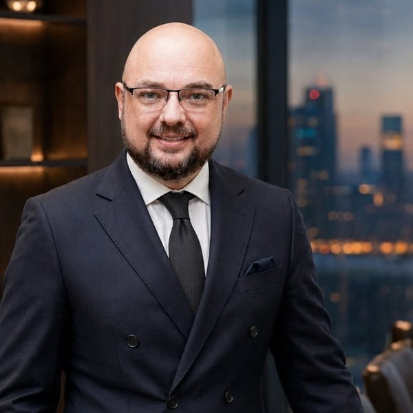

::: {.perfil}
{alt="Fábio André Malko"}

::: {.perfil-texto}
## Fábio André Malko {#perfil}

::: {.perfil-papel}
Advogado, contador e professor universitário · Doutorando em Direito, IDP
:::

::: {.perfil-links}
[ORCID 0009-0006-5975-9603](https://orcid.org/0009-0006-5975-9603)
[Currículo Lattes](https://lattes.cnpq.br/6791025189749226)
[malko@malko.adv.br](mailto:malko@malko.adv.br)
:::
:::
:::

Este endereço reúne o que escrevo e o que leio em direito tributário, penal econômico
e societário, com atenção particular ao uso de inteligência artificial na pesquisa
jurídica.

A pergunta que orienta a minha pesquisa nasceu da dupla formação. Quem trabalha com
matéria tributária pelo lado jurídico e pelo lado contábil convive diariamente com a
distância entre o que uma decisão judicial afirma e o que dela se consegue extrair de
forma sistemática. Foi essa distância que me levou à pesquisa empírica assistida por
computador, e dela ao problema que hoje ocupa a minha [linha de
pesquisa](pesquisa.qmd).

::: {.callout-warning collapse="true"}
## Pendências desta página, antes de publicar
Graduações com instituição e ano. Instituição em que leciona e disciplinas.
Conferência dos identificadores ORCID e Lattes, que não puderam ser verificados por
acesso automatizado.
:::

## O que há aqui

Em [artigos e notas](artigos.qmd) fica a produção própria, do artigo submetido a
periódico à nota curta escrita para o sítio, sempre com indicação do veículo em que
o texto saiu, quando for o caso.

Em [leituras](leituras.qmd) ficam as fichas analíticas de trabalhos de outros autores.
Cada ficha registra o que o trabalho faz, o que ele sustenta com dado próprio e onde
ele para, com remissão ao original pelo identificador digital.

A [linha de pesquisa](pesquisa.qmd) apresenta o programa em curso no doutorado, sobre
mensuração de replicabilidade em pesquisa jurídica assistida por modelos de linguagem.

## Publicado recentemente

::: {#recentes}
:::

Sobre o método de trabalho, inclusive quanto ao uso de inteligência artificial na
produção deste sítio, há [declaração própria](transparencia.qmd).
